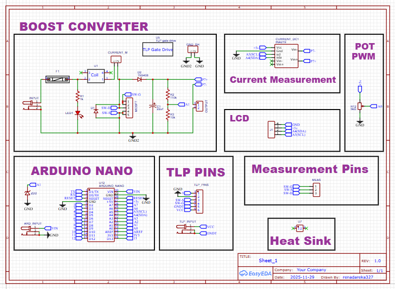
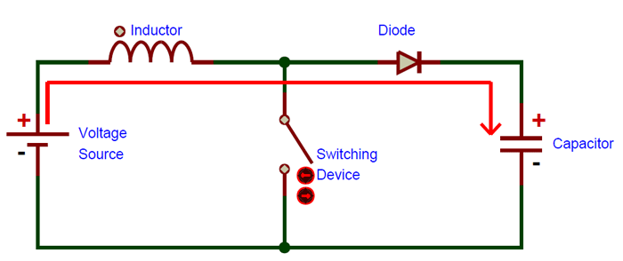
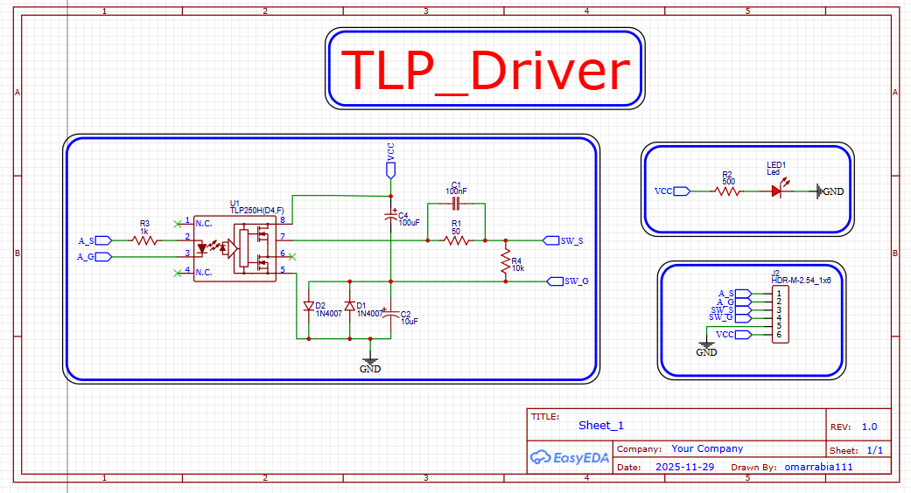
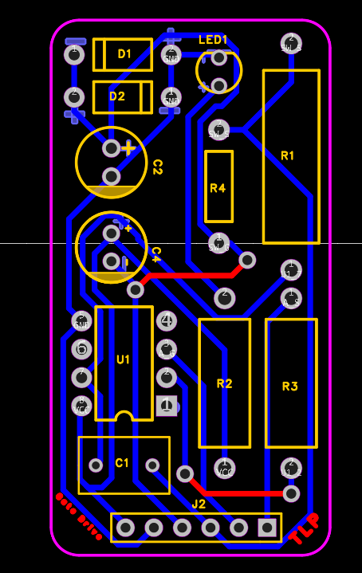
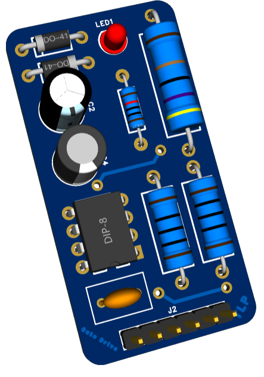
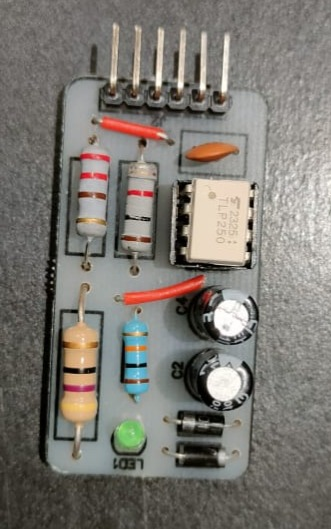

  

# 🔌 Boost Converter Project – AstraVolt

## 📌 Project Overview
This project presents the **design and implementation of an irreversible (asynchronous) DC–DC Boost Converter** as an **educational and practical power electronics system**.

The converter steps up a low DC input voltage to a higher regulated output voltage using:
- An inductor for energy storage  
- A MOSFET for high-frequency switching  
- A fast recovery diode  
- An output capacitor to reduce voltage ripple  

An **isolated gate driver (TLP250)** is used to safely interface the low-voltage control circuit (Arduino) with the high-power switching stage, improving electrical safety, noise immunity, and reliability.

---

## 🎯 Educational Objectives
This project helps learners understand:
- Inductor charging and discharging behavior  
- The effect of duty cycle on output voltage  
- Continuous Conduction Mode (CCM) operation  
- Practical component selection and real-world losses  
- The importance of isolated gate drivers  
- Voltage regulation using feedback control  

---

## ⚙️ System Architecture
The system consists of the following main blocks:
- Power Stage (Boost Converter)
- Isolated Gate Driver (TLP250)
- Control Unit (Arduino Nano)
- Measurement Circuit (INA219 + Voltage Divider)
- User Interface (LCD + Potentiometer)

---

## 🧩 Main Components

### 🔋 Power Stage Components
| Component | Description |
|---------|-------------|
| Inductor | 40 mH |
| MOSFET | IRFP260 / FQPF20N60 |
| Diode | BY399 Fast Recovery |
| Output Capacitor | 22 µF / 350 V |
| Heat Sink | TO-247 / TO-220F |

### 🧠 Control & Measurement
| Component | Function |
|---------|----------|
| Arduino Nano | PWM generation & control |
| TLP250 | Isolated MOSFET gate driver |
| INA219 | Current measurement |
| LCD 16×2 | Voltage & current display |
| Potentiometer | Duty cycle adjustment |

---

## 🔄 Boost Converter Operating Principle

### 🔹 Mode 1: Switch ON – Energy Storage
- MOSFET is ON  
- Inductor stores energy  
- Diode is reverse-biased  
- Load is supplied by the output capacitor  

  <kbd>
    
  </kbd>

---

### 🔹 Mode 2: Switch OFF – Energy Transfer
- MOSFET is OFF  
- Inductor releases stored energy  
- Diode conducts  
- Output voltage becomes higher than input voltage  

  <kbd>
    
  </kbd>

---

## 📐 Design Specifications
- **Input Voltage:** 12 V  
- **Output Voltage:** ≈ 34 V  
- **Switching Frequency:** 50 kHz  
- **Operating Mode:** CCM  
- **Control Method:** PWM with feedback  

---

## 📊 Design Summary
| Parameter | Value |
|---------|-------|
| Duty Cycle (Real) | 0.68 |
| Inductor | 40 mH |
| Peak Inductor Current | ≈ 3.55 A |
| Output Capacitor | 22 µF |
| Diode | BY399 |
| MOSFET | IRFP260 / FQPF20N60 |

---

## 🧮 Control & Firmware
The Arduino firmware performs the following tasks:
- Generates PWM at 50 kHz  
- Reads potentiometer to set duty cycle  
- Calculates theoretical output voltage  
- Measures actual voltage and current  
- Applies feedback control for voltage regulation  
- Displays data on LCD and Serial Monitor  

  <a href="images/LTspice_Simulation">
    <kbd>
      
    </kbd>
  </a>

---

## 🧪 Simulation

Simulation was performed using both **MATLAB (Simulink)** and **LTspice** to verify the boost converter operation before hardware implementation.

---

### 🔹 MATLAB (Simulink)

The MATLAB Simulink model represents the complete boost converter circuit and was used to analyze:
- Output voltage behavior  
- Inductor current waveform  
- Converter response to duty cycle changes  

  <kbd>
    
  </kbd>

#### 🔸Waveform

  <kbd>
    
  </kbd>

---

### 🔹 LTspice

LTspice simulation was used to validate the switching behavior and observe detailed waveforms, including:
- Output voltage  
- Output voltage ripple  
- Inductor current  
- MOSFET and diode voltages

  <a href="images/LTspice_Simulation">
    <kbd>
      
    </kbd>
  </a>

---

## 🧱 PCB Design

The PCB design of this project was developed using **EasyEDA** and is divided into two main sections:
1. **Isolated Gate Driver (TLP250)**
2. **Boost Converter Power Stage**

The separation improves safety, noise immunity, and overall system reliability.

---

### 🔹 Gate Driver PCB (TLP250)

The gate driver PCB provides **galvanic isolation** between the low-voltage control circuit (Arduino) and the high-power switching stage.  
It ensures clean gate signals, protects the controller, and reduces EMI.

#### 🔸 Gate Driver Schematic

  <kbd>
    
  </kbd>

#### 🔸 Gate Driver PCB Layout

  <kbd>
    
  </kbd>

#### 🔸 Gate Driver 3D View

  <kbd>
    
  </kbd>

---

### 🔹 Boost Converter PCB

The boost converter PCB contains the **power stage components**, including the MOSFET, inductor, diode, and output capacitor.  
Special attention was given to:
- Short high-current paths  
- Proper grounding  
- Thermal performance  
- High-voltage clearance  

#### 🔸 Boost Converter Schematic

  <kbd>
    
  </kbd>

#### 🔸 Boost Converter PCB Layout

  <kbd>
    
  </kbd>

#### 🔸 Boost Converter PCB 3D View

  <kbd>
    
  </kbd>

---

## 🛠️ Final Assembled Hardware

This section shows the **final hardware implementation after complete soldering and assembly**.

All boards were fully assembled, interconnected, and tested as a complete working system.

---

### 🔹 Gate Driver Board (TLP250).

  <kbd>
    
  </kbd>

---

### 🔹 Boost Converter Board

  <kbd>
    
  </kbd>

---

### 🔹 Complete System After Assembly

  <kbd>
    
  </kbd>

---

## 🧪 Testing & Results
- Tested at multiple duty cycle values
- Stable output voltage observed
- Real-time voltage and current monitoring
- Significant improvement after adding feedback control

  <kbd>
    
  </kbd>

---

## ⚠️ Challenges & Solutions

### MOSFET Availability Issue
- Some MOSFETs showed poor thermal and efficiency performance  
- **Solution:** Switched to FQPF20N60 (isolated package)

### Inductor Charging Issue
- High ripple and poor efficiency observed  
- **Solution:** Optimized inductance value and switching frequency

### Load Dependency Issue
- Output voltage varied with load changes  
- **Solution:** Implemented feedback control loop

---

## 🚀 Conclusion
This project demonstrates a **complete Boost Converter system**, covering:
**design → simulation → firmware → PCB → hardware testing**.

It provides a strong foundation for advanced power electronics designs such as:
- Synchronous boost converters  
- Isolated DC–DC converters  
- Advanced SMPS applications  

---

## 📜 License
This project is released under the  
**MIT License (Engineering Extension)**.  
Use at your own risk.

---

